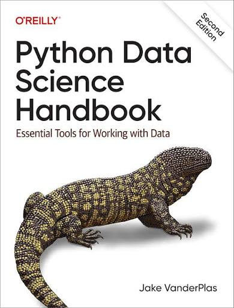

## Python Data Science Handbook: Essential Tools for Working with Data

This repository contains my personal solutions and practice notebooks for the Python Data Science Handbook: Essential Tools for Working with Data book by Jake VanderPlas.
- [Book](https://jakevdp.github.io/PythonDataScienceHandbook)
- [Book's repository](https://github.com/jakevdp/pythondatasciencehandbook)
